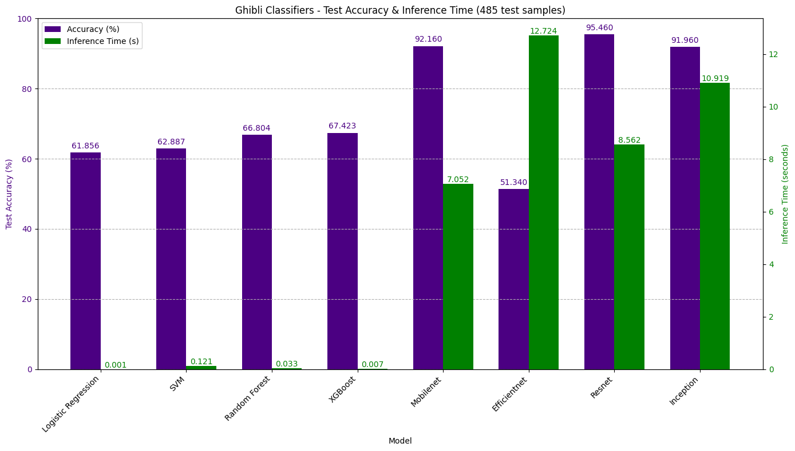

# AI Sticker Studio

## Authors
- Nikshay Jain | MM21B044
- Sahil Kokare | MM21B036
- GitHub: https://github.com/Nikshay-Jain/Sticker-Studio.git

## Table of Contents
1.  [Project Overview](#project-overview)
2.  [Features](#features)
3.  [Architecture Overview](#architecture-overview)
4.  [Directory Structure](#directory-structure)
5.  [Setup Instructions](#setup-instructions)
    - [Prerequisites](#prerequisites)
    - [Clone Repository](#clone-repository)
    - [Environment Setup](#environment-setup)
    - [Install Dependencies](#install-dependencies)
    - [Set Up Detectron2](#set-up-detectron2)
    - [Model Weights and Fonts](#model-weights-and-fonts)
    - [API Keys](#api-keys)
6.  [Usage](#usage)
    - [Module 1: Data Orchestration & Automated Pipeline](#module-1-data-orchestration--automated-pipeline)
    - [Module 2: Running the Application (Frontend & Testing)](#module-2-running-the-application-frontend--testing)
        - [Option A: Using Docker (Recommended)](#option-a-using-docker-recommended)
        - [Option B: Manual Execution](#option-b-manual-execution)
    - [Using the UI](#using-the-ui)
7.  [MLflow Tracking](#mlflow-tracking)
8.  [System Monitoring with Prometheus](#system-monitoring-with-prometheus)
9.  [Logs](#logs)
10. [Closing Note](#closing-note)
11. [Credits](#credits)

---

## Project Overview

Want to develop and get a sticker? Go ahead!

The AI Sticker Studio is a comprehensive application designed to generate custom stickers from user-provided images or text prompts. It leverages a sophisticated backend pipeline for data collection, model training, and inference, combined with a user-friendly Streamlit interface for sticker creation. This project focuses on training & evaluating fine-tuned YOLO-v8n models for image segmentation and sticker generation. The project is divided into modules including data scraping, partitioning, model training, hyperparameter tuning, performance evaluation, and application development, with a special emphasis on generating high-quality, segmented stickers and applying a distinct "Ghibli" style when appropriate.

---

## Features

* **Dual Input Methods**: Generate stickers from either uploaded images or text descriptions using generative AI.
* **Automated Data Pipeline**: A cron job module handles daily scraping of Pinterest for images to continuously fine-tune the segmentation model.
* **Advanced Segmentation**: Utilizes Detectron2 for initial mask generation and supervised fine-tuning of a YOLOv8n model for high-speed and high-performance object segmentation.
* **Themed Segmentation**: Employs an animated (Ghibli) vs. normal image classifier to select the appropriate fine-tuned YOLOv8n model (one trained on normal images, one on animated) for optimized segmentation based on the input image style.
* **Generative AI Integration**: For text-to-image sticker creation, the application integrates with external generative AI APIs (preferring Stability.ai, falling back to Modelslab) to produce animated-style images.
* **Custom Captioning**: Allows users to add custom text captions to their segmented images with selectable font styles and colors.
* **MLflow Tracking**: Tracks the entire data processing and model training pipeline using MLflow for experiment management and reproducibility.
* **System Monitoring**: A tracker module uses Prometheus for logging local machine data and exposes a node for frontend UI monitoring.
* **Local Storage**: Saves generated stickers locally for potential further refinement of models and for user download.
* **Streamlit UI**: Provides an intuitive web interface for users to interact with the sticker generation process.

---

## Architecture Overview

The project is structured into several interconnected modules:

1.  **Cron Job Module (Data Orchestration)**:
    * **Web Scraper**: Daily scrapes Pinterest for images.
    * **Training Data Preparation**: Processes scraped images.
    * **Detectron2 Integration**: Uses Detectron2 to generate high-quality masks from raw scraped images.
    * **Segmentor Model Trainer**: Uses the masked data for supervised fine-tuning of a YOLOv8n model.
2.  **Tracker Module**:
    * **Prometheus Logging**: Collects system metrics during operation.
    * **Node Exporter**: Exposes collected metrics.
    * **MLflow Tracking**: Manages and tracks experiments for the data pipeline and model training processes.
3.  **Classifier Model**:
    * A dedicated model trained to classify input images as either "Animated (Ghibli)" or "Normal". This model is crucial for directing the input to the appropriate segmentation model variant.
    * Ghibli Classifiers - Test Accuracy & Inference Time (485 test samples)
        
4.  **Segmentation Models**:
    * **YOLOv8n (Normal Fine-tuned)**: A YOLOv8n model fine-tuned specifically on "normal" (non-animated) images.
    * **YOLOv8n (Animated Fine-tuned)**: A YOLOv8n model fine-tuned specifically on "animated" images (potentially including Ghibli style).
    * The classifier determines which of these models is used for the segmentation step.
5.  **Sticker Generation Module**:
    * Takes the segmented image.
    * Adds user-defined text captions with selected font and color.
    * Saves the final sticker image.
6.  **Text-to-Image Module**:
    * Acts as an interface to generative AI APIs (Stability.ai, Modelslab).
    * Takes text prompts and generates images, preferably in an animated style.
    * The generated image is then passed to the segmentation and sticker generation pipeline.
7.  **UI (Streamlit)**:
    * Provides the user interface for input (image upload, text prompt, caption, color, font).
    * Initiates the sticker generation process based on user inputs.
    * Displays the generated sticker and provides a download option.
    * Includes a visual status indicator for the processing steps.

**Workflow Diagram:**
(The workflow is also explained in the block diagram/image referenced below from `image.png`)


The general workflow for sticker generation is as follows:
* **User Input**: User provides either an image or text, plus caption details.
* **Text-to-Image (if text input)**: If text is provided, an image is generated via GenAI APIs.
* **Classification (if image input)**: If an image is provided, the classifier determines if it's Animated or Normal.
* **Segmentation**: The appropriate YOLOv8n model (Normal or Animated) is used to segment the image.
* **Sticker Generation**: The segmented image is combined with the user's caption.
* **Output**: The final sticker is saved and displayed in the UI for download.

---

## Directory Structure

```bash
project_root/
├── Backend-Model-Development/   # Orchestration module (Data scraping, model training)
├── Frontend-Tester/             # Code to test model and use Streamlit app
│   └── src/
│   |   ├── app.py               # Main Streamlit application file
│   |   └── install_detectron2.py # Script to install Detectron2
|   |   └──  ...
|   ├── models/                      # Directory for trained model weights
│   |   ├── Ghibli-normal-classifier/
│   |   ├── yolo_normal/
│   |   ├── yolo_animated/
|   |   └──  ...
|   ├── fonts/                       # Directory for font files
|   ├── logs/                        # Directory for log files
|   ├── requirements.txt             # Python dependencies
|   ├── Dockerfile                   # Docker configuration file
└── Readme.md                    # Project documentation