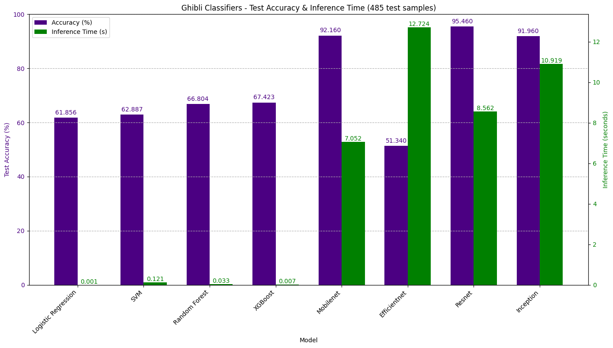
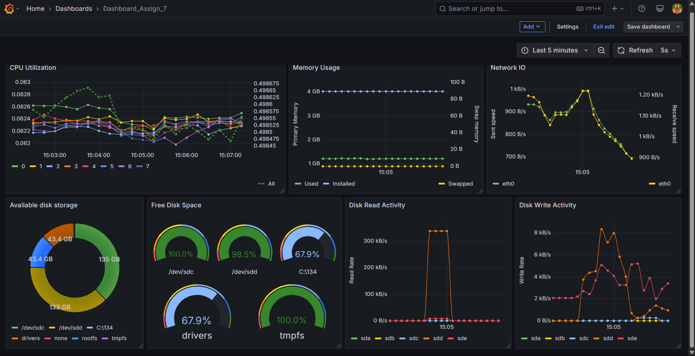

# 🖼️ Sticker Studio – User Manual
**Authors**: Nikshay Jain | MM21B044 & Sahil Kokare | MM21B036

---

## 📌 Introduction

**Sticker Studio** is an end-to-end pipeline for generating creative Ghibli-style or normal stickers using advanced AI techniques. It combines scraping, model training (YOLOv8 and Detectron2), text-to-image generation (StabilityAI), image classification, segmentation, captioning, and monitoring via Prometheus & Grafana.

This user manual outlines the system architecture, setup instructions, and usage guidance, integrating details from your README and the project diagram.

---

## 🧠 System Overview

The system comprises the following integrated modules:

### 1. Scraper & Dataset Management
- This is a custom script that sets up the cron job to scrap the Pinterest website for anime images to create teh dataset need for finetuning the Yolov8 model for doing the iamge segmentation job.
- The cron job runs daily scraping around 100 to 150 images on each run.
- This dataset which is scraped is traced using DVC to be fetch during the training phase of the model.

### 2. Segmentor Model Training
- Two segmentation backbones supported:
  - **YOLOv8n** (finetuned for speed, low compute)
  - **Detectron2** (high accuracy, high compute)
- The Detectron2 model is a high accuracy model but it comes at teh tradeoff of low speed, whereas the Yolov8n model is a high speed moderately accurate model for teh image classifiation and segmentatino task. Thus to address this issue of low speed using Detectron2 model wherein teh Yolov8n model is NOT very accurate, we trained teh Yolov8n model using the Detectron model on teh dataset scraped above for a specific subset of images, specifically anime like images and gave these masks generated by Detectron model to teh Yolov8n model to train itself upon. 
- The resultant model is a Yolov8n model with high accuracy and low speed features for such images.
- Side note the models are trained on gpus uisng colab gpus These need to be trained before execution of hte script as teh models are NOT provided in this github.
- The Yolov8n model training hyperparams and metrics are tracked using MLflo. Since the Yolov8n model is a standard model all the standard metrics are collected for each subsequentyl trained model on each day.
- Human feedback loop to improve segmentation performance.

### 3. Classifier
- After comparing vaious models over accuracy of classification and time of inferencing, a MobileNet classifier was used that detects whether an image is "Ghibli" or "Normal".
- The plot for the same is attached here:
Ghibli Classifiers - Test Accuracy & Inference Time (485 test samples)

- This helps to decide which segmentation model (the one finetuned on normal images vs the one on animated (ghibli) images) should be called.

### 4. Frontend & Backend Application
- **Streamlit UI** allows:
  - Text-to-image generation via StabilityAI or ModelsLab fallback.
  - Image-to-sticker generation by a parallel pathway.
  - Upload your own image.
  - Select font style and colour for caption.
  - Press Generate Sticker button.

- Backend logic handles:
  - Classification - animated vs normal
  - Segmentation
  - Caption placement
  - File saving and return

### 5. Monitoring Stack
- **Prometheus** tracks metrics like:
  - Inference latency
  - Number of calls
  - Failure/success ratios
- **Grafana** visualizes metrics in near real time


- Python's `prometheus_client` exposes metrics on port `18000`

---

## 📂 Directory Structure

```bash
project_root/
├── Backend-Model-Development/   # Orchestration module (Data scraping, model training)
├── Frontend-Tester/             # Code to test model and use Streamlit app
│   └── src/
│   |   ├── app.py               # Main Streamlit application file
│   |   └── install_detectron2.py # Script to install Detectron2
|   |   └──  ...
|   ├── models/                      # Directory for trained model weights
│   |   ├── Ghibli-normal-classifier/
│   |   ├── yolo_normal/
│   |   ├── yolo_animated/
|   |   └──  ...
|   ├── fonts/                       # Directory for font files
|   ├── logs/                        # Directory for log files
|   ├── requirements.txt             # Python dependencies
|   ├── Dockerfile                   # Docker configuration file
└── Readme.md                    # Project documentation
```
---

## ⚙️ Setup Instructions

### 1. Clone the Repository
```bash
git clone https://github.com/Nikshay-Jain/Sticker-Studio.git
cd Sticker-Studio
```

### 2. Setup Python Environment
Recommended OS: WSL (Ubuntu) or macOS  
Python version: **3.9**

Install dependencies:
```bash
pip install torch torchvision torchaudio --index-url https://download.pytorch.org/whl/cpu
pip install -r requirements.txt
```

### 3. Install Detectron2
```bash
python3 Frontend-Tester/src/install_detectron2.py
```

---

## 🚀 Running the App

### Launch the Frontend (Streamlit)
```bash
cd Frontend-Tester
streamlit run src/app.py
```

---

## 📈 Monitoring

### Start Exporter (runs in background)
```bash
python3 Frontend-Tester/src/main.py
```

### Run Prometheus & Grafana (Docker)
Ensure your Prometheus config is correct and run:
```bash
docker-compose up -d
```

### View Dashboards
- 🔗 Prometheus: http://localhost:9090  
- 📊 Grafana: http://localhost:3000

---

## 🧪 How It Works (from UI)

1. **User Inputs**: Upload image or enter text
2. **Image Generation**: Calls Stability AI / ModelsLab API
3. **Classification**: MobileNet classifies image as "Normal" or "Ghibli"
4. **Segmentation**:
   - Normal image → Normal YOLOv8
   - Ghibli image → Finetuned YOLOv8
5. **Captioning & Styling**
6. **Downloadable Sticker** served to user

---

## 🐞 Logs & Debugging

All logs are saved in:
```
Frontend-Tester/logs/
```

Errors in image generation, model failures, or API issues are logged here.

---

## 📌 Notes

- The project supports DVC-based reproducibility
- Cron jobs automate scraping & dataset updates
- All metrics can be visualized live via Grafana
